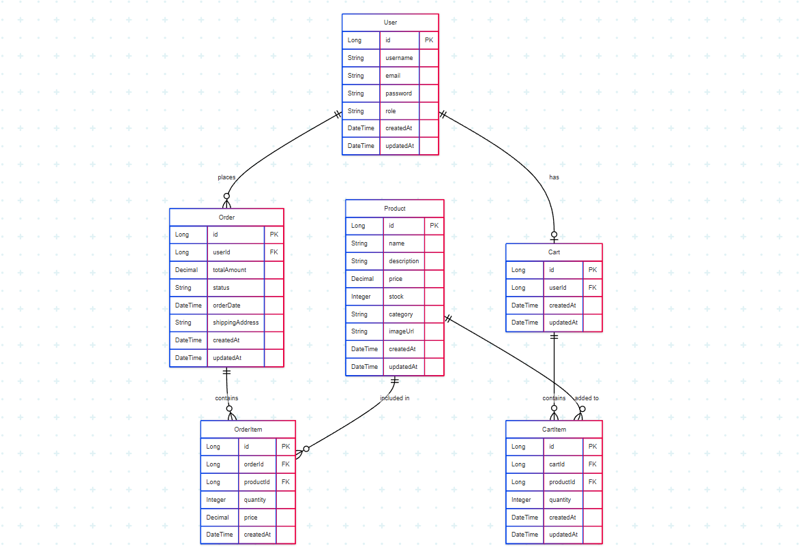
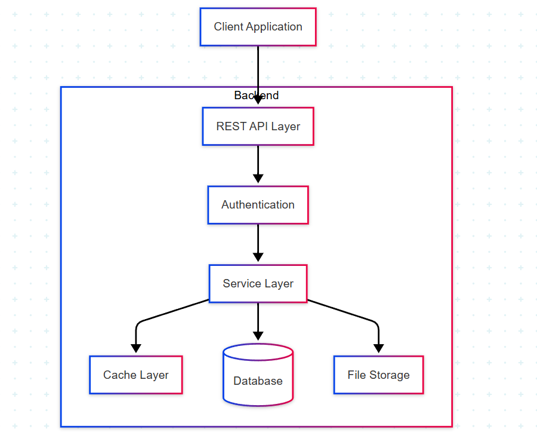
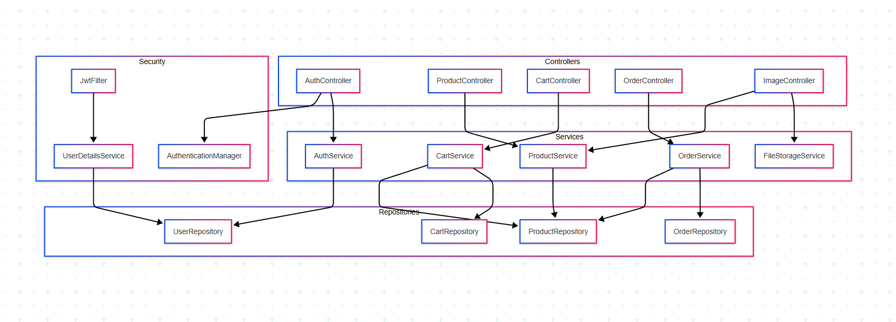

# Hệ Thống API Cửa Hàng Trang Sức

Dự án REST API Spring Boot cho website cửa hàng trang sức với các tính năng xác thực người dùng, quản lý sản phẩm, giỏ hàng và xử lý đơn hàng.

## Nguyên Tắc, Mẫu Thiết Kế và Thực Hành Phát Triển Phần Mềm

### Kiến Trúc
- **Kiến Trúc Phân Lớp**: Ứng dụng tuân theo mô hình kiến trúc phân lớp rõ ràng:
  - Controllers (Tầng API)
  - Services (Tầng Xử Lý Logic)
  - Repositories (Tầng Truy Cập Dữ Liệu)
  - Entities (Tầng Mô Hình Dữ Liệu)

### Mẫu Thiết Kế
- **Mẫu DTO**: Sử dụng cho việc truyền dữ liệu giữa các tầng
- **Mẫu Repository**: Trừu tượng hóa việc truy cập dữ liệu
- **Mẫu Builder**: Sử dụng trong các đối tượng phản hồi
- **Dependency Injection**: Sử dụng IoC container của Spring để giảm sự phụ thuộc

### Các Nguyên Tắc Lập trình Được Sử dụng
- **Nguyên Tắc SOLID**: Tuân thủ các nguyên tắc trách nhiệm đơn lẻ, mở-đóng và đảo ngược phụ thuộc
- **Thiết Kế API RESTful**: Tuân thủ quy ước REST cho các endpoint API
- **Bảo Mật**: Xác thực dựa trên JWT và phân quyền theo vai trò
- **Kiểm Tra Đầu Vào**: Sử dụng Jakarta Validation
- **Xử Lý Ngoại Lệ**: Xử lý ngoại lệ toàn cục với mã trạng thái HTTP phù hợp
- **Lombok**: Giảm thiểu mã soạn sẵn
- **Quản Lý Giao Dịch**: Đảm bảo tính nhất quán dữ liệu

## Cấu Trúc Mã Nguồn

```
backend/
├── src/
│   ├── main/
│   │   ├── java/
│   │   │   └── com/minh/jewerlystore/
│   │   │       ├── config/         # Các lớp cấu hình
│   │   │       ├── controller/     # Các REST controller
│   │   │       ├── entity/         # Các entity JPA
│   │   │       ├── exception/      # Các ngoại lệ tùy chỉnh
│   │   │       ├── mapper/         # Các bộ chuyển đổi DTO
│   │   │       ├── payload/        # DTO Request/Response
│   │   │       ├── repository/     # Các repository JPA
│   │   │       ├── security/       # Cấu hình bảo mật
│   │   │       └── service/        # Xử lý logic nghiệp vụ
│   │   └── resources/
│   │       └── application.properties
│   └── test/                       # Unit test
```

## Hướng Dẫn Cài Đặt

### Yêu Cầu Hệ Thống
- Java 21
- PostgreSQL 12+
- Maven 3.8+
- Node.js và npm (cho phần frontend)

### Cài Đặt Cơ Sở Dữ Liệu
1. Tạo cơ sở dữ liệu PostgreSQL tên `jewelrystore`
2. Cập nhật cấu hình cơ sở dữ liệu trong `application.properties`:
```properties
spring.datasource.url=jdbc:postgresql://localhost:5432/jewelrystore
spring.datasource.username=your_username
spring.datasource.password=your_password
```

### Cài Đặt Backend
1. Clone repository
2. Di chuyển vào thư mục backend
3. Cấu hình các thuộc tính ứng dụng:
   - JWT secret và thời gian hết hạn
   - URL frontend cho CORS
   - Thư mục upload file
4. Build và chạy:
```bash
mvn clean install
mvn spring-boot:run
```

Ứng dụng sẽ tự động tạo tài khoản admin khi chạy lần đầu:
- Tên đăng nhập: admin
- Mật khẩu: admin123

## Tài Liệu API

Tất cả các API endpoints được cung cấp trong file Postman Collection: `Jewelry_Store_API.postman_collection.json`

### Hướng Dẫn Sử Dụng Postman Collection

1. Tải và cài đặt [Postman](https://www.postman.com/downloads/)
2. Import file `Jewelry_Store_API.postman_collection.json` vào Postman
3. Tạo môi trường (Environment) mới trong Postman với biến:
   - `authToken`: để lưu token xác thực

### Các Nhóm API

1. **Auth** - Xác thực người dùng
   - Đăng ký
   - Đăng nhập
   - Đăng xuất

2. **Products** - Quản lý sản phẩm
   - Xem danh sách sản phẩm
   - Tìm kiếm sản phẩm
   - Thêm/sửa/xóa sản phẩm (Admin)

3. **Cart** - Quản lý giỏ hàng
   - Thêm vào giỏ hàng
   - Cập nhật số lượng
   - Xóa khỏi giỏ hàng

4. **Orders** - Quản lý đơn hàng
   - Tạo đơn hàng
   - Xem đơn hàng
   - Cập nhật trạng thái (Admin)

5. **Images** - Quản lý hình ảnh
   - Tải lên hình ảnh sản phẩm
   - Xem hình ảnh

### Xác Thực

API sử dụng xác thực dựa trên JWT thông qua Cookie. Sau khi đăng nhập, token sẽ được tự động lưu vào cookie của Postman và sẽ gửi đi cho mỗi lần thực hiện các yêu cầu đến máy chủ

## Bảo Mật

- Xác thực dựa trên JWT
- Phân quyền theo vai trò (USER, ADMIN)
- Lưu trữ mật khẩu an toàn bằng BCrypt
- Cấu hình CORS cho tích hợp frontend
- Bảo vệ các endpoint bằng Spring Security

## Tải Lên Tập Tin

- Hỗ trợ tải lên hình ảnh cho sản phẩm
- Thư mục tải lên có thể cấu hình
- Giới hạn kích thước tập tin:
  - Kích thước tối đa mỗi tập tin: 10MB
  - Kích thước tối đa mỗi request: 10MB

## Kiểm Thử Đơn Vị (Unit Testing)

Dự án sử dụng JUnit 5 và Mockito cho việc kiểm thử đơn vị toàn diện. Các test được tổ chức theo cấu trúc tương tự như mã nguồn chính.

### Công Nghệ và Công Cụ
- JUnit 5: Framework kiểm thử chính
- Mockito: Framework mô phỏng đối tượng
- AssertJ: Thư viện assertion
- MockMvc: Kiểm thử REST endpoints

### Phạm Vi Kiểm Thử

1. **AuthController Tests**
   - Kiểm tra đăng nhập và đăng ký
   - Xác thực token JWT
   - Xử lý thông tin người dùng
   - Kiểm tra đăng xuất
   - Xử lý các trường hợp lỗi xác thực

2. **CartController và CartService Tests**
   - Thao tác với giỏ hàng (thêm, cập nhật, xóa)
   - Tính toán tổng giá trị giỏ hàng
   - Kiểm tra số lượng sản phẩm
   - Xử lý các trường hợp lỗi

3. **ProductController và ProductService Tests**
   - Thao tác CRUD với sản phẩm
   - Tìm kiếm và lọc sản phẩm
   - Phân trang kết quả
   - Xử lý các trường hợp không tìm thấy sản phẩm

4. **ImageController Tests**
   - Tải lên hình ảnh
   - Lấy và xóa hình ảnh
   - Cập nhật hình ảnh sản phẩm
   - Xử lý các định dạng file
   - Kiểm tra lỗi tải lên

### Quy Ước và Best Practices

1. **Cấu Trúc Test**
   - Tuân theo mẫu Arrange-Act-Assert
   - Tên test mô tả rõ ràng kịch bản kiểm thử
   - Mỗi test tập trung vào một tính năng cụ thể

2. **Mô Phỏng (Mocking)**
   - Sử dụng @Mock cho các dependency
   - Định nghĩa behavior cụ thể cho mỗi test
   - Xác minh tương tác giữa các đối tượng

3. **Xử Lý Ngoại Lệ**
   - Kiểm tra các trường hợp ngoại lệ
   - Xác minh thông báo lỗi
   - Đảm bảo xử lý lỗi phù hợp

4. **Độc Lập của Test**
   - Mỗi test có thể chạy độc lập
   - Sử dụng @BeforeEach cho thiết lập chung
   - Tránh phụ thuộc vào trạng thái bên ngoài

### Chạy Unit Test

Để chạy toàn bộ unit test:
```bash
mvn test
```

Để chạy test cho một class cụ thể:
```bash
mvn test -Dtest=TenClassTest
```

Để xem báo cáo coverage:
```bash
mvn test jacoco:report
```
Báo cáo coverage sẽ được tạo trong thư mục `target/site/jacoco/index.html` 

## Sơ Đồ Hệ Thống

### Sơ Đồ Quan Hệ Thực Thể (ERD)



### Sơ Đồ Kiến Trúc Hệ Thống



### Sơ Đồ Thành Phần


